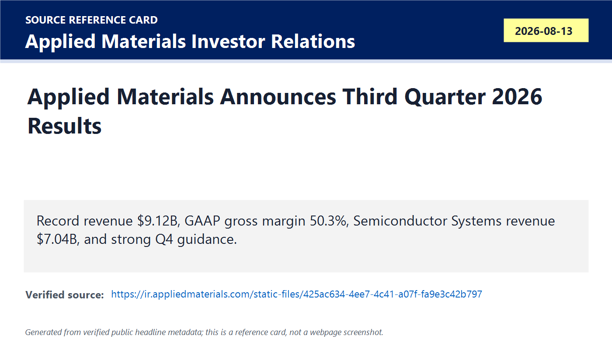
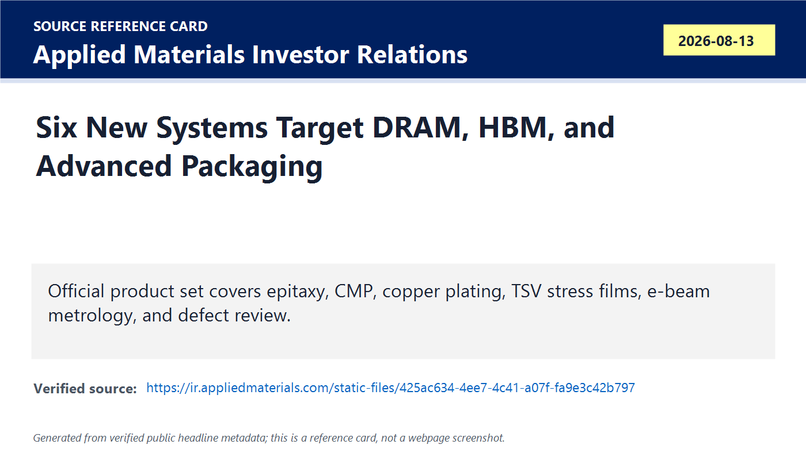
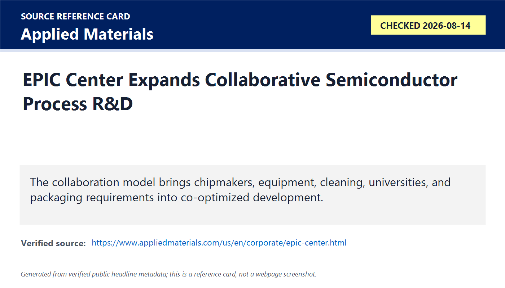
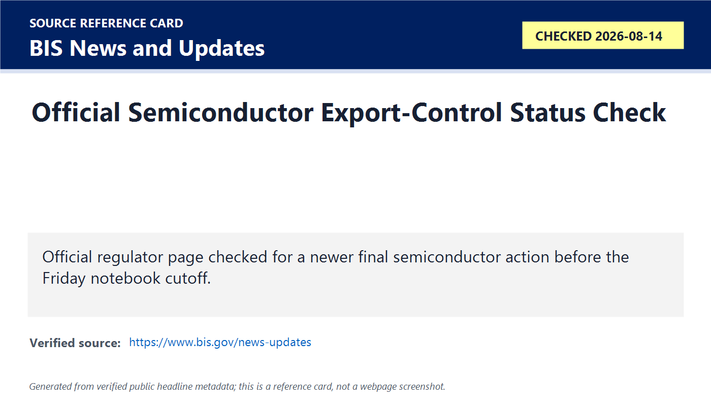

# Daily Semiconductor Current Affairs

Date: 2026-08-14

Research window: Friday update through approximately 23:15 IST on August 14, 2026. The main completed proof point is Applied Materials' fiscal Q3 2026 result, released after the U.S. market close on August 13. The note separates reported financial results, product/process evidence, and forward-looking guidance, while keeping regulator and India-event checks explicitly open where no newer official milestone was found.

## Quick Index

| Date | Major Topic | Source Groups | Why To Read |
|---|---|---|---|
| 2026-08-14 | Applied Materials posts record Q3 | Applied Materials earnings release | Tests whether AI demand is translating into wafer-fabrication equipment, service, margins, and cash generation. |
| 2026-08-14 | DRAM, foundry/logic, and advanced packaging drive the outlook | Applied Materials release and presentation | Connects HBM and leading-edge AI chips to deposition, etch, CMP, plating, metrology, and defect review. |
| 2026-08-14 | Six new systems expose the manufacturing bottlenecks | Applied Materials product disclosures | Turns earnings into a technical study of strain, TSV stress, hybrid-bonding flatness, copper fill, and e-beam inspection. |
| 2026-08-14 | EPIC Center expands collaborative process R&D | Applied Materials / UC Berkeley / Broadcom / SCREEN context | Shows why next-generation process modules need co-optimization across equipment, materials, devices, packaging, and cleaning. |
| 2026-08-14 | India and policy checks remain open | SEMICON India; BIS | Keeps the August 16 hackathon deadline and official-rule discipline visible. |

**Page navigation:** [Sources](#source-map) · [Concept review](#concept-review) · [Follow-up](#what-to-watch-next) · [Technical terms](#technical-terms-used-today) · [Master glossary](../knowledge-base/glossary.md)

## Technical Terms / Deep Definitions

Term: Wafer-fabrication equipment
Definition: Wafer-fabrication equipment is the set of tools used to deposit, pattern, etch, implant, clean, polish, inspect, and measure materials while building devices and interconnects on wafers. It solves the physical manufacturing problem of turning a circuit design into repeatable nanoscale structures. Applied Materials' Semiconductor Systems revenue of $7.04B makes WFE the central evidence in today's result. Source: https://www.semi.org/en/resources/semiconductor101

Term: Epitaxy
Definition: Epitaxy is the controlled growth of a crystalline layer whose atomic structure follows the underlying crystal. It solves the need to create high-quality, composition- and doping-controlled regions for transistors and other devices. Applied's enhanced Centura Prime Epi grows doped silicon germanium and silicon phosphorus in source/drain regions to improve strain, drive current, and efficiency for DRAM and HBM-related devices. Source: https://www.appliedmaterials.com/us/en/semiconductor/products/processes/epitaxy.html

Term: Chemical mechanical planarization
Definition: Chemical mechanical planarization, or CMP, combines chemical reactions and mechanical polishing to flatten a wafer or package surface. It solves the topography problem: later lithography and bonding steps need very small height variation. Applied's Opta Quad CMP monitors wafer conditions during polish and adjusts in real time, which is especially important before hybrid bonding. Source: https://www.appliedmaterials.com/us/en/semiconductor/products/processes/chemical-mechanical-planarization.html

Term: Total thickness variation
Definition: Total thickness variation is the difference between the thickest and thinnest measured points across a wafer, die, or processed layer. It solves the flatness-control problem by quantifying non-uniformity. In advanced packaging and hybrid bonding, excessive variation can prevent uniform contact, create voids, and reduce yield. Source: https://www.semi.org/en/standards

Term: Electrochemical deposition
Definition: Electrochemical deposition, or ECD, uses an electrical current in a chemical bath to plate metal onto patterned surfaces. It solves the need to fill vias and build copper interconnect structures with controlled thickness and uniformity. Applied's Nokota VMax 2 ECD targets TSV fill, microbumps, and fine-pitch advanced-packaging interconnects. Source: https://www.appliedmaterials.com/us/en/semiconductor/products/processes/electrochemical-deposition.html

Term: Through-silicon via
Definition: A through-silicon via, or TSV, is a vertical conductive connection passing through a silicon die. It solves the bandwidth and footprint problem by connecting stacked dies through short vertical paths rather than long package traces. HBM uses many TSVs across stacked DRAM dies, making via fill, dielectric stress, thinning, alignment, and reliability crucial. Source: https://www.semi.org/en/resources/semiconductor101

Term: Plasma-enhanced chemical vapor deposition
Definition: Plasma-enhanced chemical vapor deposition, or PECVD, uses plasma energy to drive chemical reactions that deposit thin films at lower temperatures than purely thermal CVD. It solves the need to add dielectrics and protective films without exceeding the thermal budget of sensitive structures. Applied's Avila 2 PECVD deposits stress-balanced films around TSVs to support thinner DRAM dies in tall HBM stacks. Source: https://www.appliedmaterials.com/us/en/semiconductor/products/processes/chemical-vapor-deposition.html

Term: Critical-dimension e-beam metrology
Definition: Critical-dimension e-beam metrology uses a focused electron beam to measure very small feature widths, profiles, and structural details. It solves the resolution problem that limits optical measurement on sub-10nm or complex heterogeneous features. Applied's VeritySEM 7AP targets thick and warped advanced-packaging substrates where accurate feature control is essential. Source: https://www.appliedmaterials.com/us/en/semiconductor/products/processes/metrology-and-inspection.html

Term: Defect review
Definition: Defect review is high-resolution imaging and classification of suspected manufacturing defects after an inspection system identifies candidate locations. It solves the yield-learning problem by separating real process failures from nuisance signals and tracing failures back to a tool, material, or step. Applied's SEMVision G7AP extends e-beam defect review across silicon, organic, and glass packaging substrates. Source: https://www.appliedmaterials.com/us/en/semiconductor/products/processes/metrology-and-inspection.html

Term: Yield learning
Definition: Yield learning is the iterative process of finding defect patterns, identifying root causes, changing process conditions, and verifying that a larger share of manufactured dies or packages meets specification. It solves the economic gap between making a device once and manufacturing it profitably at scale. Today's metrology and defect-analysis systems matter because advanced packaging adds interfaces where failures can occur. Source: https://www.semi.org/en/resources/semiconductor101

Term: Hybrid bonding
Definition: Hybrid bonding joins two extremely flat surfaces using direct dielectric bonding plus fine-pitch metal connections, commonly copper-to-copper. It solves the interconnect-density and power problem of microbumps by enabling shorter, denser die-to-die connections. It also demands exceptional cleanliness, alignment, and planarization, which is why CMP and defect control are central to Applied's advanced-packaging story. Source: https://www.appliedmaterials.com/us/en/semiconductor/products/advanced-packaging.html

Term: Process co-optimization
Definition: Process co-optimization is the joint tuning of multiple manufacturing steps, materials, devices, packages, and design assumptions rather than improving each step independently. It solves interaction problems in which a change that helps deposition may hurt etch, cleaning, bonding, reliability, or device performance. Applied's EPIC Center partnerships aim to shorten the path from laboratory material innovation to manufacturable process flow. Source: https://www.appliedmaterials.com/us/en/corporate/epic-center.html

Term: Geographic revenue mix
Definition: Geographic revenue mix is the share of company sales attributed to customer locations or shipment destinations by region. It solves the exposure question by showing how much revenue depends on different markets and policy environments. Applied reported 28% of Q3 revenue from China, down from 35% a year earlier, while the United States rose to 15% from 9%. Source: https://ir.appliedmaterials.com/static-files/425ac634-4ee7-4c41-a07f-fa9e3c42b797

## Source Images

## Source Map

| Item | Source | Date | Link | Use In This Note |
|---|---|---|---|---|
| Applied Materials fiscal Q3 results | Applied Materials Investor Relations | Aug. 13, 2026 | https://ir.appliedmaterials.com/static-files/425ac634-4ee7-4c41-a07f-fa9e3c42b797 | Official financial results, segment mix, product highlights, geography, and Q4 guidance. |
| Applied Materials Q3 presentation | Applied Materials Investor Relations | Aug. 13, 2026 | https://ir.appliedmaterials.com/static-files/9d5d182d-f060-4b22-a32c-4582257fdc9b | Official visual and management context for AI-driven equipment demand. |
| Applied Materials advanced packaging | Applied Materials | Checked Aug. 14, 2026 | https://www.appliedmaterials.com/us/en/semiconductor/products/advanced-packaging.html | Technical background for hybrid bonding, TSVs, interconnect, CMP, and packaging processes. |
| Applied Materials EPIC Center | Applied Materials | Checked Aug. 14, 2026 | https://www.appliedmaterials.com/us/en/corporate/epic-center.html | Official collaborative R&D and process co-optimization context. |
| BIS policy status | Bureau of Industry and Security | Checked Aug. 14, 2026 | https://www.bis.gov/news-updates | Official check for newer final semiconductor/export-control actions. |
| SEMICON India Hackathon | SEMICON India | Checked Aug. 14, 2026 | https://www.semiconindia.org/special-features-2026/Hackathon | Official August 16 proposal deadline and India talent/action item. |

## Deep Briefing

### 1. Applied Materials provides upstream proof of the AI semiconductor cycle

Applied Materials reported record fiscal Q3 revenue of $9.115B, up 25% year over year. GAAP gross margin was 50.3%, operating margin was 33.7%, and diluted EPS was $3.17. Non-GAAP gross margin was 50.4%, operating margin was 34.0%, and diluted EPS was a record $3.50. Cash from operations reached $3.037B.

This is upstream evidence. GPU and cloud demand becomes equipment demand only when foundries, memory makers, and packaging houses commit to more capacity and more complex process steps. Applied's result shows that the AI cycle is pulling on materials engineering, not only finished accelerators.

The margin result also matters. Revenue growth accompanied margin expansion, which indicates that demand, product value, service contribution, and factory execution were strong enough to improve economics. The limitation is familiar: non-GAAP numbers exclude selected items, and future guidance remains uncertain.

### 2. Segment and application mix identify the strongest manufacturing layers

Semiconductor Systems revenue was $7.040B versus $5.564B a year earlier. Within that segment, foundry, logic, and other contributed 67%; DRAM contributed 26%; and flash memory contributed 7%. Applied Global Services revenue was $1.781B versus $1.463B.

DRAM's mix increased from 22% to 26%, consistent with AI-driven HBM and advanced-memory investment. Foundry and logic remained the largest pool because leading-edge compute requires advanced transistors, interconnects, power delivery, and packaging. Flash remained a smaller share, which cautions against describing every memory category as equally strong.

Services matter because installed tools require parts, maintenance, upgrades, software, and process support. Service growth can be more stable than new-tool sales and also reveals whether the installed base is highly utilized.

### 3. The new product set is a map of HBM and chiplet bottlenecks

Applied highlighted six systems for DRAM and advanced packaging. Centura Prime Epi targets strained and doped source/drain regions. Opta Quad CMP controls within-wafer flatness and total thickness variation for hybrid bonding. Nokota VMax 2 ECD improves copper plating uniformity for TSVs and microbumps. Avila 2 PECVD builds stress-balanced films around TSVs so thinner DRAM dies can survive 12-, 16-, and future higher-layer HBM stacks. VeritySEM 7AP measures small features on thick, warped heterogeneous substrates. SEMVision G7AP performs high-resolution defect review across silicon, organic, and glass substrates.

Together, these tools show why advanced packaging is not merely placing finished dies next to each other. It is a sequence of materials, topography, stress, plating, alignment, inspection, and yield-control problems. HBM capacity can be constrained by any one of these steps even if DRAM cells and logic base dies work correctly.

### 4. Guidance implies continued investment into fiscal Q4 and 2027

Applied guided fiscal Q4 revenue to $10.25B plus or minus $500M and non-GAAP diluted EPS to $4.02 plus or minus $0.20. Management said it expects continued growth, particularly in DRAM, leading-edge foundry/logic, and advanced packaging, and is adding manufacturing capacity for projected demand through the end of the decade.

The midpoint would represent another large sequential step from Q3, but it remains guidance. The proper follow-up is whether customer capex, tool shipments, installation, acceptance, and service utilization validate the forecast. Equipment suppliers can record strong orders before a fab reaches stable yield, so WFE strength should be paired with foundry, memory, and packaging output evidence.

### 5. Geographic mix shows policy exposure changing, not disappearing

China represented 28% of Q3 revenue, down from 35% a year earlier. The United States represented 15%, up from 9%; Taiwan 22%; Korea 17%; Japan 9%; Europe 5%; and Southeast Asia 4%.

The decline in China's percentage does not eliminate export-control risk. It shows a more diversified quarter and stronger U.S. demand, while China remained the single largest geographic share. Equipment companies must manage license requirements, customer screening, product classifications, service restrictions, and changing rules alongside commercial demand.

### 6. EPIC Center partnerships illustrate process co-optimization

Applied said the EPIC Center had expanded to 11 engagements, with Broadcom, UC Berkeley, and SCREEN among the newly highlighted partners. Broadcom brings advanced-packaging system requirements; UC Berkeley contributes university research; SCREEN contributes wafer-cleaning expertise. The value of this model is physical co-development: deposition, etch, clean, metrology, packaging, and device behavior interact, so sequential handoffs can slow learning.

For VLSI students, this is a reminder that design-technology co-optimization extends beyond standard-cell libraries. At advanced nodes and in advanced packages, circuit architecture, layout, materials, process windows, thermals, power delivery, test, and reliability must be considered together.

### 7. India relevance: equipment and materials capability is now the harder frontier

India's Semicon 2.0 framing emphasizes equipment, materials, design IP, supply chains, research, and talent. Applied's result explains why those pillars matter. A functioning semiconductor ecosystem needs far more than a fab shell: it needs deposition and etch subsystems, vacuum hardware, RF power, gas delivery, chemicals, precision motion, sensors, metrology, cleaning, spares, field service, automation, and process engineering.

Near-term Indian participation can grow through tool subassemblies, electronics, precision components, software, facilities engineering, packaging/test equipment, reliability labs, and field-service talent. The August 16 SEMICON India Hackathon deadline is a smaller but immediate action point: a strong proposal should target a real process, inspection, navigation, verification, or yield problem and state how success will be measured.

## Follow-Up Ledger

| Prior item | Status on 2026-08-14 | Evidence |
|---|---|---|
| Applied Materials FY2026 Q3 | Closed: official result and supporting materials published | Applied Materials IR |
| Coherent FY2026 Q4 | Closed on August 13; next proof is capacity and guidance conversion | Coherent |
| Intel $20B offering close | No separate official close announcement verified in this window | Intel IR / SEC watch |
| BIS semiconductor policy | No newer final semiconductor action verified at cutoff | BIS |
| SEMICON India Hackathon | Open: proposal deadline is August 16 | SEMICON India |

## Concept Review

| Concept | Deep Definition | Why It Matters In This News | Revise Next | Source |
|---|---|---|---|---|
| WFE as upstream demand evidence | Equipment sales show that chipmakers are committing capital to add or upgrade physical manufacturing capability. | Applied's record Semiconductor Systems revenue shows AI demand pulling upstream. | Deposition, etch, CMP, metrology, process control. | https://www.semi.org/en/resources/semiconductor101 |
| HBM process stack | HBM requires DRAM fabrication, thinning, TSVs, dielectric stress control, stacking, bonding, packaging, inspection, and test. | Applied's six systems target several different bottlenecks in the same HBM/advanced-packaging flow. | TSV, microbump, hybrid bonding, warpage, yield. | https://www.appliedmaterials.com/us/en/semiconductor/products/advanced-packaging.html |
| Yield learning | Inspection and metrology data must be converted into root-cause process changes. | VeritySEM and SEMVision target measurement and defect review on complex substrates. | Defect density, nuisance signals, process window, excursion control. | https://www.appliedmaterials.com/us/en/semiconductor/products/processes/metrology-and-inspection.html |
| Process co-optimization | Multiple process modules and design assumptions are tuned together because each affects the others. | EPIC partnerships join equipment, cleaning, university research, and chip/system requirements. | DTCO, STCO, integration, reliability. | https://www.appliedmaterials.com/us/en/corporate/epic-center.html |
| Geographic policy exposure | Revenue concentration by country affects licensing, tariffs, service, and customer risk. | China fell as a percentage but remained Applied's largest geography. | EAR classifications, licenses, end users, diversification. | https://www.bis.gov/licensing |

## Simple Explanation

Applied Materials' record quarter shows that AI demand is reaching the machines used to manufacture chips. Revenue was $9.12B, Semiconductor Systems was $7.04B, and margins improved. DRAM, leading-edge foundry/logic, and advanced packaging were the main growth areas. The six highlighted tools solve real HBM and chiplet problems such as TSV copper fill, wafer flatness, die stress, feature measurement, and defect review. China exposure declined as a share but remains significant. For India, the lesson is that equipment, materials, process engineering, packaging, test, and field service are essential ecosystem layers.

## Interview Questions

1. Why is wafer-equipment revenue considered upstream evidence of semiconductor demand?
2. How do CMP and total thickness variation affect hybrid bonding yield?
3. Why do tall HBM stacks make TSV stress and ultra-thin-die stability difficult?
4. What is the difference between inspection and defect review?
5. Why can geographic revenue mix create export-control risk even when demand is strong?
6. What does process co-optimization change compared with improving one tool step at a time?

## What To Watch Next

- Whether Applied converts Q4 guidance into shipments, installations, customer acceptance, and service growth.
- DRAM/HBM equipment mix, hybrid-bonding adoption, and packaging yield evidence.
- Foundry and logic capex from TSMC, Samsung, Intel, and other customers.
- China revenue, license exposure, and any new final BIS action.
- Coherent's optical capacity conversion and the broader copper-to-optical transition.
- SEMICON India Hackathon proposal submission by August 16.

## Technical Terms Used Today

[Back to quick index](#quick-index) · [Open the master A-Z glossary](../knowledge-base/glossary.md)

**Term index:** [Chemical mechanical planarization](#daily-term-chemical-mechanical-planarization) · [Critical-dimension e-beam metrology](#daily-term-critical-dimension-e-beam-metrology) · [Defect review](#daily-term-defect-review) · [Electrochemical deposition](#daily-term-electrochemical-deposition) · [Epitaxy](#daily-term-epitaxy) · [Geographic revenue mix](#daily-term-geographic-revenue-mix) · [Hybrid bonding](#daily-term-hybrid-bonding) · [Plasma-enhanced chemical vapor deposition](#daily-term-plasma-enhanced-chemical-vapor-deposition) · [Process co-optimization](#daily-term-process-co-optimization) · [Through-silicon via](#daily-term-through-silicon-via) · [Total thickness variation](#daily-term-total-thickness-variation) · [Wafer-fabrication equipment](#daily-term-wafer-fabrication-equipment) · [Yield learning](#daily-term-yield-learning)

| Term | Meaning |
|---|---|
| [**Chemical mechanical planarization**](../knowledge-base/glossary.md#term-chemical-mechanical-planarization) | Chemical mechanical planarization, or CMP, combines chemical reactions and mechanical polishing to flatten a wafer or package surface. It solves the topography problem: later lithography and bonding steps need very small height variation. |
| [**Critical-dimension e-beam metrology**](../knowledge-base/glossary.md#term-critical-dimension-e-beam-metrology) | Critical-dimension e-beam metrology uses a focused electron beam to measure very small feature widths, profiles, and structural details. It solves the resolution problem that limits optical measurement on sub-10nm or complex heterogeneous features. |
| [**Defect review**](../knowledge-base/glossary.md#term-defect-review) | Defect review is high-resolution imaging and classification of suspected manufacturing defects after an inspection system identifies candidate locations. It solves the yield-learning problem by separating real process failures from nuisance signals and tracing failures back to a tool, material, or step. |
| [**Electrochemical deposition**](../knowledge-base/glossary.md#term-electrochemical-deposition) | Electrochemical deposition, or ECD, uses an electrical current in a chemical bath to plate metal onto patterned surfaces. It solves the need to fill vias and build copper interconnect structures with controlled thickness and uniformity. |
| [**Epitaxy**](../knowledge-base/glossary.md#term-epitaxy) | Epitaxy is the controlled growth of a crystalline layer whose atomic structure follows the underlying crystal. It solves the need to create high-quality, composition- and doping-controlled regions for transistors and other devices. |
| [**Geographic revenue mix**](../knowledge-base/glossary.md#term-geographic-revenue-mix) | Geographic revenue mix is the share of company sales attributed to customer locations or shipment destinations by region. It solves the exposure question by showing how much revenue depends on different markets and policy environments. |
| [**Hybrid bonding**](../knowledge-base/glossary.md#term-hybrid-bonding) | Hybrid bonding joins two extremely flat surfaces using direct dielectric bonding plus fine-pitch metal connections, commonly copper-to-copper. It solves the interconnect-density and power problem of microbumps by enabling shorter, denser die-to-die connections. |
| [**Plasma-enhanced chemical vapor deposition**](../knowledge-base/glossary.md#term-plasma-enhanced-chemical-vapor-deposition) | Plasma-enhanced chemical vapor deposition, or PECVD, uses plasma energy to drive chemical reactions that deposit thin films at lower temperatures than purely thermal CVD. It solves the need to add dielectrics and protective films without exceeding the thermal budget of sensitive structures. |
| [**Process co-optimization**](../knowledge-base/glossary.md#term-process-co-optimization) | Process co-optimization is the joint tuning of multiple manufacturing steps, materials, devices, packages, and design assumptions rather than improving each step independently. It solves interaction problems in which a change that helps deposition may hurt etch, cleaning, bonding, reliability, or device performance. |
| [**Through-silicon via**](../knowledge-base/glossary.md#term-through-silicon-via) | A through-silicon via, or TSV, is a vertical conductive connection passing through a silicon die. It solves the bandwidth and footprint problem by connecting stacked dies through short vertical paths rather than long package traces. |
| [**Total thickness variation**](../knowledge-base/glossary.md#term-total-thickness-variation) | Total thickness variation is the difference between the thickest and thinnest measured points across a wafer, die, or processed layer. It solves the flatness-control problem by quantifying non-uniformity. |
| [**Wafer-fabrication equipment**](../knowledge-base/glossary.md#term-wafer-fabrication-equipment) | Wafer-fabrication equipment is the set of tools used to deposit, pattern, etch, implant, clean, polish, inspect, and measure materials while building devices and interconnects on wafers. It solves the physical manufacturing problem of turning a circuit design into repeatable nanoscale structures. |
| [**Yield learning**](../knowledge-base/glossary.md#term-yield-learning) | Yield learning is the iterative process of finding defect patterns, identifying root causes, changing process conditions, and verifying that a larger share of manufactured dies or packages meets specification. It solves the economic gap between making a device once and manufacturing it profitably at scale. |

This page-end index covers the specialist terms central to this day's study. The fuller explanation, news context, and source remain at first use; the master glossary combines repeated terms across all days.
